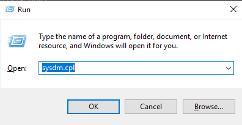
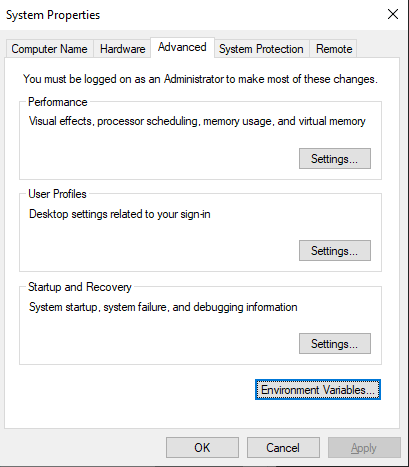
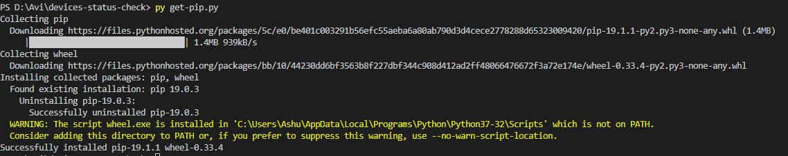

Devices Status Check
===============================================================


<!-- TOC -->

- [Software Requirements](#software-requirements)
    - [Python](#python)
    - [Pip](#pip)

<!-- /TOC -->

## Software Requirements
### Python

The latest version of python can be downloaded from the below url.  
https://www.python.org/downloads/

- After the successful installation, add python.exe/py.exe file to the Path variable just to access python from everywhere in the command prompt.
Do that step only if you don't find python after you type python or py on cmd

- Win + R and type in sysdm.cpl to open system properties




- Click on Advanced Tab and click on Environment Variables



- On the System Variables tab, find path and double click on it, add the location of py.exe or python.exe file.
Typically it should be C:/Windows/

### Pip
It should be available after you install python. If not follow the below instructions.

- Download the file **get-pip.py** from the below link.
- Save it locally in your computer, open cmd at the file location
- Run the below command
```
py get-pip.py
```

Some how you should be able to find the pip path and add it to the environment variables



